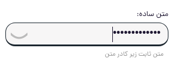
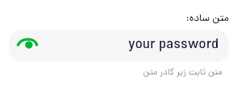

# JBInput React

this component is React.js wrapper for [jb-input](https://www.npmjs.com/package/jb-input) web component.

text input `react component` with these benefits:

- easy to add custom regex or function validation.

- multiple validation with different message.

- support both RTL and LTR.

- add label and message in UX friendly format.

- customizable ui with css variable so you can have multiple style in different scope of your app.

- custom display for password and number input.

- support typescript

##demo image:    



## install

### using npm

``` command
npm i jb-input-react
```
in your jsx file
```js
import {JBInput} from 'jb-input-react';
```
``` jsx
<JBInput class="" label="لیبل" message="متن ثابت زیر کادر متن"></JBInput>
```


## events
- onChange
```jsx 
    <JBInput onChange={(event) => console.log(event.target.value)}></JBInput>
```
- onKeyUp
```jsx 
    <JBInput onKeyUp={(event) => console.log(event.target.value)}></JBInput>
```
- onEnter
```jsx 
    <JBInput onEnter={(event) => console.log(event.target.value)}></JBInput>
```
- onKeydown
```jsx 
    <JBInput onKeydown={(event) => console.log(event.target.value)}></JBInput>
```
- onFocus
```jsx 
    <JBInput onFocus={(event) => console.log(event.target.value)}></JBInput>
```
- onBlur
```jsx 
    <JBInput onBlur={(event) => console.log(event.target.value)}></JBInput>
```


## set validation

you can set validation to your input by creating a validationList array and passing in to validationList props:

``` javascript
    const validationList = [
        {
            validator: /.{3}/g,
            message: 'عنوان حداقل باید سه کارکتر طول داشته باشد'
        },
        #you can use function as a validator too
        {
            validator: (inputtedText)=>{return inputtedText == "سلام"},
            message: 'شما تنها میتوانید عبارت سلام را وارد کنید'
        },
    ]
```
```jsx
    <JBInput validationList={validationList}></JBInput>
```

## check validation

you can check if an input value meet your validation standad by creating a ref of the element using `React.createRef()`.
```javascript
    const elementRef = React.createRef();
    const isValid = elementRef.current.triggerInputValidation(true).isAllValid;
```
if `isValid` is `true` the value of input is valid.

## number input extra feature
if you set type="number" JBInput will add some feature for you. for example your input will only get number chart and wont accept other string and we add 2 + & - button to the input so user can change number without keyboard by just taping on these buttons. you can also use Up and Down arrow keys too increase or decrease number value in your field.
JBInput will also let you control some aspect of user input too for example you can limit decimal precision or change increase/decrease step of + - button.
too achive this you must call one function and set value you need to change.

### number input events
click on + - button will call onChange event.

```javascript 
  const numberFieldParameter = {
        //how many number you want to + or  - on user press buttons or use arrow keys default is 1
        step:100,
        // how many decimal input accept default is infinity
        decimalPrecision:2,
        // what char replaced to input if user paste some illegal value default is '' (empty string)
        invalidNumberReplacement:'0',
        // separate every 3 number with comma like 1000000 => 1,000,000
        useThousandSeparator:false,
        // which char we use to separate thousand number
        thousandSeparator:',',
        //can input accept negative number or not
        acceptNegative:true,
    }
```
```jsx
    <JBInput numberFieldParameter={numberFieldParameter}></JBInput>

```

## other props
|props name | description        |
| --------- | ------------------ |
| disabled	| disable the input  |
| inputmode | set input mode help mobile device to open proper keyboard for your input like url, search and numeric |
| direction | set web-component direction defualt set is rtl but if you need ltr use <JBInput direction="ltr"></JBInput> |


## set custome style

in some cases in your project you need to change defualt style of web-component for example you need zero margin or different border-radius and etc.
if you want to set a custom style to this web-component all you need is to set css variable in parent scope of web-component

| css variable name	                | description                                                                                |
| --------------------------------  | ------------------------------------------------------------------------------------------ |
| --jb-input-margin	                | component margin defualt is 0 12px                                                         |
| --jb-input-border-radius		    | omponent border-radius defualt is 16px                                                     |
| --jb-input-border-color		    | border color of select in normal mode                                                      |
| --jb-input-border-color-focus	    | border color of select in normal mode                                                      |
| --jb-input-bgcolor	            | background color of input                                                                  |
| --jb-input-border-bottom-width	| border bottom thickness desualt is 3px                                                     |
| --jb-input-label-font-size		| font size of input label defualt is 0.8em                                                  |
| --jb-input-label-color		    | change label color defualt is #1f1735                                                      |
| --jb-input-message-font-size		| font size of message we show under input                                                   |
| --jb-input-message-error-color	| change color of error we show under input defualt is red                                   |
| --jb-input-height		            | height of input defualt is 40px                                                            |
| --jb-input-placeholder-color		| change placeholder color                                                                   |
| --jb-input-placeholder-font-size  | change placeholder font-size                                                               |
| --jb-input-value-font-size		| input value font-size                                                                      |
| --jb-input-value-color        	| input value color                                                                          |
| --jb-input-input-padding	        | set input inner padding default is 2px 12px 0 12px                                         |
| --jb-input-input-text-align		| set input element text align for example if you have number Input and want to make it left |
| --jb-input-box-shadow			    | set box shadow of input                                                                    |
| --jb-input-box-shadow-focus		| set box shadow of input on focus                                                           |

### number input special style

 css variable name	                      | description                       |
| --------------------------------        | ----------------------------------|
| --jb-input-increase-button-color	      | + button fill color               |
| --jb-input-increase-button-color-hover  | + button fill color on hover      |
| --jb-input-decrease-button-color		  | - button fill color               |
| --jb-input-decrease-button-color-hover  | - button fill color on hover      |
| --jb-input-number-button-width	      | number input width                |
| --jb-input-number-button-height		  | number input height               |
| --jb-input-decrease-button-border		  | decrease button borderm           |
| --jb-input-increase-button-border		  | increase button border            |
| --jb-input-increase-button-border-radius| increase button border-radius     |
| --jb-input-decrease-button-border-radius| decrease button border-radius     |
| --jb-input-increase-button-bg		      | increase button background color  |
| --jb-input-decrease-button-bg		      | decrease button background color  |


## add custom element in input box

in JBInput you can put icon or any other custom html DOM in input box. to doing so you just have to place custom DOM in JBInput tag and add `slot="start-section"` or `slot="end-section"` to place it before or after input field. 

``` javascript
<JBInput>
    <div slot="end-section">after</div>
    <div slot="start-section">before</div>
</JBInput>
```